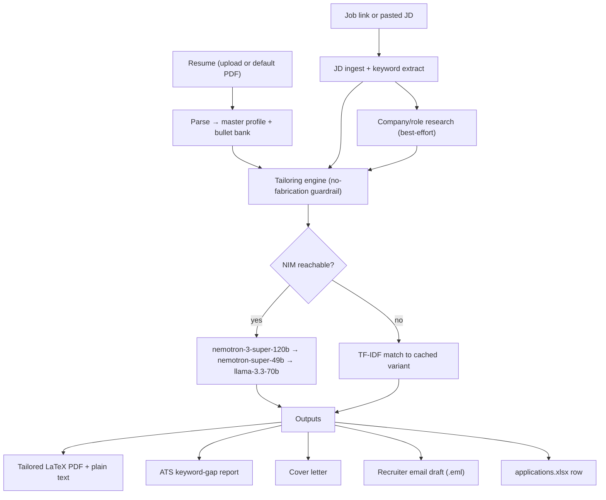

# Resume Job-Hunt Toolkit

A toolkit that tailors your resume to each job description using **free NVIDIA NIM models**, with ATS keyword-gap checks, cover letters, recruiter email drafts, a **job searcher** (free sources) with an application tracker, an opt-in **local browser auto-fill** assistant, and an **offline cached-variant fallback** when the API is unreachable.

Runs in **two modes**: `local` (full features on your Windows PC, Tectonic PDFs, browser auto-fill) and `cloud` (a private, password-gated web app you can reach anywhere — see [docs/DEPLOY_CLOUD.md](docs/DEPLOY_CLOUD.md)).

Built for **Nishkarsh Jain** (VLSI/ASIC Design Verification primary; RTL, PD/STA, Emulation, Embedded, RF/DSP/SDR secondary) targeting **India + remote** roles. No Synopsys licenses or corporate tool paths required.

---

## What it does

| Feature | Description |
|---------|-------------|
| **Resume ReBuilder / Tailor** | Parses your master resume, matches it to a JD, reorders skills, and selects/rephrases bullets **per experience & project** (an index-based contract so the whole resume is tailored, not just the summary). Strict **no-fabrication** guardrail — only your real content is used. |
| **Reliable PDF (3 engines)** | ATS-safe one-column resume via **Tectonic** (LaTeX, local) → **WeasyPrint** (HTML→PDF, cloud) → **fpdf2** (pure-Python, always works). Always also writes `.tex`, `.html`, and `.txt`. |
| **ATS keyword-gap check** | Compares JD keywords vs. your tailored resume; reports missing terms, formatting issues, and an overall match score. |
| **Cover letter & recruiter email** | Tailored cover letter, plus a review-and-send `.eml` with the resume attached (never auto-sent). |
| **Job searcher** | Finds open roles from **free/legal** sources — Adzuna (India), Remotive (remote), and company boards (Greenhouse, Lever). Relevance-scored, deduped, freshness-filtered. No LinkedIn/Naukri scraping. |
| **Tracker + status pipeline** | SQLite job store with `found → shortlisted → tailored → applied → interview → closed`, deduped so you never re-apply. Mirrored to `applications.xlsx`. |
| **Apply assistant (local only)** | For jobs **you select**: open the apply link, or best-effort **browser auto-fill** using your logged-in profile that **pauses for your review and never submits**. |
| **Offline fallback** | Six pre-built resume variants matched locally via **TF-IDF** when NVIDIA NIM is unreachable. |

All AI features are powered by **free NVIDIA NIM** models (a few API calls per job — well within the free tier).

---

## Architecture



**Pipeline summary**

1. **Parse** — `pdfplumber` extracts structure from your seed PDF or upload → `config/profile.yaml` + bullet bank.
2. **Ingest JD** — Paste text or provide a link (best-effort fetch; paste fallback when LinkedIn/Naukri block scraping).
3. **Research** — Optional online company/role context (skipped gracefully when offline).
4. **Tailor** — AI selects bullets, rewrites summary/skills ordering; falls back through the model chain on errors.
5. **Render** — Jinja2 LaTeX template → PDF via Tectonic; optional DOCX export.
6. **ATS / Cover letter / Email / Tracker** — Parallel outputs saved to disk.

---

## Model selection

All models use the OpenAI-compatible endpoint **`https://integrate.api.nvidia.com/v1`** with an `nvapi-` key in `.env`.

| Role | Model | Why |
|------|-------|-----|
| **Tailoring (default)** | `meta/llama-3.3-70b-instruct` | Reliable instruct model that returns clean JSON. The reasoning-heavy primary tended to emit long `<think>` output and truncate the tailored resume, which caused the "only the summary generated" bug. Configurable via `models.tailor`. |
| **Primary (research/other)** | `nvidia/nemotron-3-super-120b-a12b` | Large context, strong reasoning; still the default for non-tailoring tasks. |
| **Fallback 1 / 2** | `nvidia/llama-3.3-nemotron-super-49b-v1.5`, `meta/llama-3.3-70b-instruct` | Automatic fallback chain on worker limits/timeouts. |
| **Utility** | `nvidia/nemotron-3-nano-30b-a3b` | Fast/cheap for ATS keyword extraction and light tasks. |
| **Offline** | Local TF-IDF matcher | No network; picks the best cached variant from `resumes/variants/`. |

**Free tier:** ~**40 requests/min**. Normal use stays well within limits. Model slugs (incl. `models.tailor`) live in `config/settings.yaml` and can be overridden via `SETTINGS__...` environment variables.

---

## Setup on Windows (primary)

Your personal PC — no Synopsys tools needed.

### 1. Install Python 3.11+

Download from [python.org](https://www.python.org/downloads/) and check **"Add Python to PATH"** during install.

### 2. Install Tectonic (LaTeX → PDF)

Tectonic compiles the tailored resume without a full TeX distribution.

**winget (recommended):**

```powershell
winget install TectonicProject.Tectonic
```

**scoop (alternative):**

```powershell
scoop install tectonic
```

Verify: open a new terminal and run `tectonic --version`.

### 3. Clone or copy the project

Place the `Resume_Automate/` folder on your PC (e.g. `C:\Users\You\Resume_Automate`).

### 4. Create virtual environment and install dependencies

`run.bat` does this automatically on first launch. For manual setup:

```powershell
cd C:\path\to\Resume_Automate
py -3.11 -m venv venv
venv\Scripts\activate
pip install -r requirements.txt
```

### 5. Get a free NVIDIA API key

1. Sign up at [build.nvidia.com](https://build.nvidia.com).
2. Generate an API key (starts with `nvapi-`).
3. Copy `.env.example` to `.env` and set:

```env
NVIDIA_API_KEY=nvapi-your-actual-key-here
```

### 6. Add your seed resume

Place your master resume PDF at `data/seed_resume.pdf` (or upload in the app on first run).

### 7. Launch

Double-click **`run.bat`** or from a terminal:

```powershell
run.bat
```

The Streamlit app opens in your default browser (typically `http://localhost:8501`).

On first run, if `config/profile.yaml` is missing, `run.bat` parses `data/seed_resume.pdf` automatically. Review and fill any `TODO` fields in `profile.yaml` (location, target titles, notice period).

---

## Setup on Linux (dev / smoke test)

```bash
chmod +x run.sh
./run.sh
```

Or manually:

```bash
python3.11 -m venv venv
source venv/bin/activate
pip install -r requirements.txt
python -m src.resume_parser          # parse seed resume → profile.yaml
python -m src.nim_client --smoke     # check NIM reachability
streamlit run app.py
```

---

## How to use

1. **Pick or upload your resume** — Default is `data/seed_resume.pdf`; you can upload a different PDF per session.
2. **Paste a job description** — Full JD text works best. You can also paste a LinkedIn/Naukri/company-portal **link**; the app will try to fetch it, but if scraping is blocked, paste the JD text manually (this is normal).
3. **Run the actions you need:**

   | Button | Output |
   |--------|--------|
   | **Tailor** | Tailored resume PDF + `.tex` + plain text in `resumes/output/` |
   | **ATS** | Keyword-gap report (missing terms, score, formatting notes) |
   | **Cover letter** | Tailored cover letter document |
   | **Email** | Recruiter email draft (`.eml` with resume attached) |
   | **Save to tracker** | New row in `data/applications.xlsx` |

4. **Review before sending** — Open the PDF, read the cover letter, and open the `.eml` in Outlook/Thunderbird to review and send manually. Nothing is auto-submitted.

### Where outputs land

| Path | Contents |
|------|----------|
| `resumes/output/` | Per-job tailored PDF, LaTeX source, plain text, cover letter, email drafts |
| `resumes/variants/` | Six cached role variants (DV, RTL, PD/STA, Emulation, Embedded, SW/EDA) |
| `data/applications.xlsx` | Application tracker spreadsheet |
| `config/profile.yaml` | Your structured master profile (edit directly for permanent fixes) |

---

## Hosting options

| Option | How | Best for |
|--------|-----|----------|
| **(a) Local `run.bat`** ⭐ | Double-click `run.bat` (`mode: local`) | Daily use; full features incl. Tectonic PDFs + browser auto-fill. Private. |
| **(b) Cloudflared tunnel** | Run locally, then `cloudflared tunnel --url http://localhost:8501` | Occasional phone access to your local instance. |
| **(c) Streamlit Community Cloud (private)** ⭐ cloud | Push to a **private** GitHub repo → deploy `app.py` at [share.streamlit.io](https://share.streamlit.io); set secrets in the dashboard | **Free**, private, always-available web app (`mode: cloud`), reachable anywhere. |
| **(d) Render / Google Cloud Run (Docker)** | Container deploy from the same `Dockerfile` | Alternatives: full WeasyPrint PDFs; Render free tier has cold starts, Cloud Run free tier needs a card on file. |

> Note: Hugging Face **Docker** Spaces now require a paid PRO plan (only static Spaces are free), so Streamlit Community Cloud is the recommended **free** private host.

For cloud, the app runs **password-gated** (`app_password` secret) and uses the portable **HTML→PDF** engine (fpdf2 on Streamlit Cloud); browser auto-fill is disabled server-side (apply = open link). Full step-by-step in **[docs/DEPLOY_CLOUD.md](docs/DEPLOY_CLOUD.md)**. Recommendation: **(a)** for daily hunting, **(c)** when you want it always-on and private for free.

---

## Troubleshooting

| Problem | What to do |
|---------|------------|
| **429 rate limit** | You hit ~40 req/min on the free tier. Wait 1–2 minutes; the client retries with exponential backoff automatically. Space out batch runs if tailoring many jobs at once. |
| **503 / worker-limit on primary model** | Normal during peak load. The app automatically falls back to `nvidia/llama-3.3-nemotron-super-49b-v1.5`, then `meta/llama-3.3-70b-instruct`. No action needed. |
| **Tectonic not found** | Install Tectonic (see Setup) and restart your terminal. Ensure `tectonic` is on your PATH. PDF export will fail without it; plain-text export still works. |
| **JD link scraping blocked** | LinkedIn, Naukri, and many portals gate automated fetching. **Paste the JD text** into the app instead — this is the reliable path. |
| **Offline / no API key** | The toolkit switches to **offline mode**: TF-IDF matching picks the closest cached variant from `resumes/variants/`. Tailoring quality is lower but you still get a usable resume. Restore connectivity and API key for full AI tailoring. |
| **Empty or wrong profile** | Re-run `python -m src.resume_parser` after updating `data/seed_resume.pdf`, then edit `config/profile.yaml` for any `TODO` fields. |
| **NIM smoke test fails** | Run `python -m src.nim_client --smoke` to verify key and connectivity. Check `.env` has a valid `NVIDIA_API_KEY`. |

---

## Privacy

- **`.env`**, secrets, resume PDFs, `data/*.xlsx`, `data/*.db`, and `resumes/output/` are **gitignored** — not committed.
- **Nothing is uploaded** except the text you send to **NVIDIA NIM** (tailoring/ATS/cover/email) and the job-search queries you run against free public APIs.
- **No auto-send email.** The apply assistant is **local-only, opt-in per job, and never clicks submit** — it fills the form and pauses for your review. It is disabled in cloud mode.
- For cloud, gate the app with `app_password` and keep the repo/Space **private**; the job DB and tracker live under `DATA_DIR`.

---

## Project layout

```
Resume_Automate/
├── app.py                    # Home page (Streamlit multipage entry)
├── pages/
│   ├── 1_Tailor_Resume.py    # JD → tailor → ATS → cover → email → track
│   └── 2_Job_Search.py       # search → track → select → tailor → apply
├── run.bat / run.sh          # Local launchers
├── Dockerfile                # Cloud image (HF Spaces / Render / Fly)
├── requirements.txt          # Core deps (fpdf2)
├── requirements-local.txt    # + playwright (auto-fill)
├── requirements-cloud.txt    # + weasyprint (HTML→PDF)
├── .streamlit/               # config.toml + secrets.toml.example
├── config/
│   ├── profile.yaml          # Identity + parsed resume (source of truth)
│   └── settings.yaml         # mode, features, models, job_search, paths
├── data/                     # profile cache; jobhunt.db + applications.xlsx (gitignored)
├── src/
│   ├── nim_client.py         # NIM client (robust JSON, <think> stripping, repair)
│   ├── resume_parser.py      # PDF → profile (+ artifact cleanup)
│   ├── tailor.py             # Index-based tailoring + no-fabrication guardrail
│   ├── render_latex.py       # Renderer: Tectonic → WeasyPrint → fpdf2
│   ├── job_search.py         # Adzuna/Remotive/Greenhouse/Lever adapters
│   ├── jobs_db.py            # SQLite pipeline + applications.xlsx export
│   ├── apply_assist.py       # Local browser auto-fill (review-before-submit)
│   ├── ui_common.py          # Shared UI (auth, sidebar, tailoring, downloads)
│   ├── ats.py / cover_letter.py / email_draft.py / company_research.py
│   ├── jd_ingest.py / variant_library.py / tracker.py / settings_loader.py
├── templates/
│   ├── resume.tex.j2         # LaTeX (Tectonic)
│   ├── resume.html.j2        # HTML (WeasyPrint) + fpdf2 mirrors this layout
│   ├── cover_letter.tex.j2 / email_recruiter.j2
└── resumes/
    ├── variants/             # Cached role variants (offline)
    └── output/               # Per-job generated files
```

---

## Further reading

See **[GUIDE.md](GUIDE.md)** for a practical playbook: LinkedIn optimization, application funnel strategy, VLSI DV resume keywords, and how each toolkit feature supports getting more interviews.
