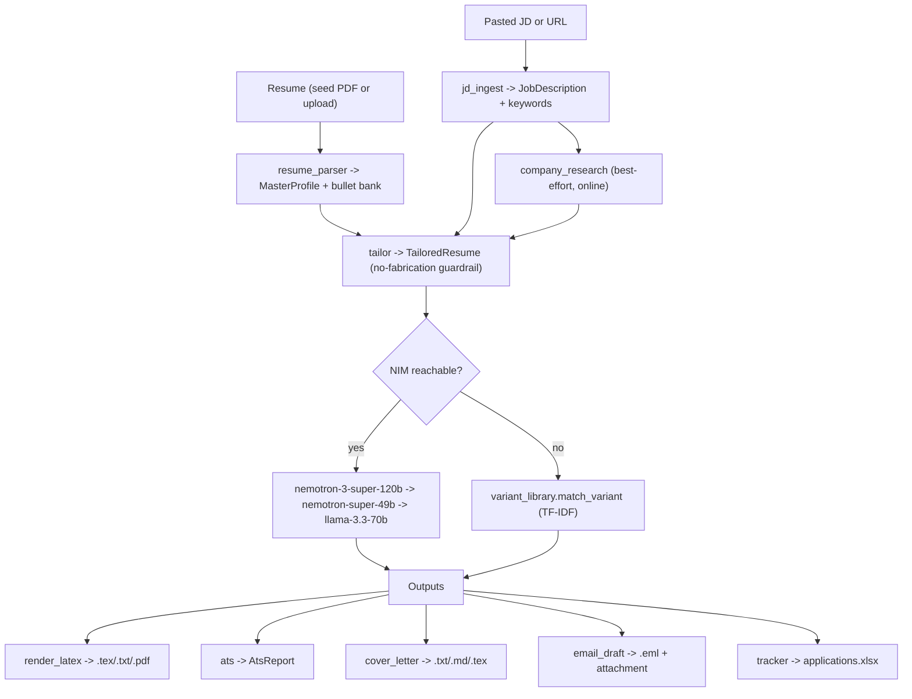

# Architecture

How the **Resume Job-Hunt Toolkit** is put together: the pipeline, the modules, the data contracts, and the online/offline behavior.

---

## High-level pipeline

The Streamlit UI (`app.py`) orchestrates these modules and holds state between steps in `st.session_state`.

---

## Module map (`src/`)

| Module | Key entry points | Responsibility |
|--------|------------------|----------------|
| `settings_loader.py` | `load_settings()`, `project_root()`, `resolve_path(key, settings)` | Load `config/settings.yaml`, apply env overrides, resolve paths relative to the project root. |
| `nim_client.py` | `NimClient(settings)`, `.chat()`, `.chat_json()`, `.is_reachable()`, `.list_models()` | OpenAI-compatible client for NVIDIA NIM. Primary + fallback model chain, retry/backoff on 429/timeout. |
| `resume_parser.py` | `parse_resume(pdf)`, `ensure_profile(settings)`, `load_profile(path)`, `save_profile(profile, path)` | Extract a `MasterProfile` + bullet bank from a PDF via `pdfplumber`; read/write `profile.yaml`. |
| `jd_ingest.py` | `ingest_jd(text=, url=)` | Build a `JobDescription` from pasted text or a best-effort URL fetch; extract requirements + keywords. |
| `company_research.py` | `research(company, role, jd)` | Optional online company/role context. Returns `{}` gracefully when offline/blocked. |
| `tailor.py` | `tailor_resume(profile, jd, research)` | Core engine: select/rephrase bullets, reorder skills, rewrite summary; enforce the no-fabrication guardrail. |
| `ats.py` | `ats_report(tailored_or_text, jd)` | Score 0-100 from weighted keyword coverage + format checks; matched/missing keywords + suggestions. |
| `render_latex.py` | `render_resume(tailored, out_dir, basename, formats, settings)` | Fill the LaTeX template, escape/sanitize, compile PDF via Tectonic, always emit `.txt`; optional DOCX. |
| `cover_letter.py` | `generate_cover_letter(profile, jd, tailored, research, out_dir, basename, ..., settings)` | Generate a tailored cover letter (`.txt`/`.md`/`.tex`). |
| `email_draft.py` | `build_recruiter_email(profile, jd, resume_path, tailored, out_dir, basename, ..., settings)` | Build a review-and-send `.eml` with the resume attached (no auto-send). |
| `variant_library.py` | `build_variants()`, `match_variant(jd, settings)`, `load_variant_tailored(name, settings)`, `list_variants()` | Build the 6 cached variants; offline TF-IDF match to the closest one. |
| `tracker.py` | `ensure_tracker(path)`, `add_application(...)`, `update_status(...)`, `list_applications(path)`, `default_tracker_path(settings)` | Excel application log via `openpyxl`. |
| `schemas.py` | dataclasses below | Shared data contracts used across all modules. |

`app.py` is the Streamlit UI that wires these together into the 6-step flow.

---

## Data contracts (`src/schemas.py`)

All dataclasses expose `to_dict()` / `from_dict()`.

**MasterProfile**
- `identity`: `{name, email, phone, location, linkedin, github, portfolio_links[]}`
- `summary`: `str`
- `skills`: `dict[str, list[str]]` (category -> skills)
- `experience[]`: `{company, title, location, start, end, bullets[]}`
- `projects[]`: `{name, link, tech[], bullets[]}`
- `education[]`: `{institution, degree, field, start, end, gpa, location}`
- `certifications[]`, `achievements[]`: `str`
- `bullet_bank[]`: `{id, text, tags[], source: 'experience'|'project', has_metric: bool}`

**JobDescription**
- `{raw_text, source_url, title, company, location, seniority, requirements[], keywords[]}`

**TailoredResume** - same fields as `MasterProfile`, plus:
- `meta`: `{job_title, company, jd_keywords[], matched_keywords[], missing_keywords[], model_used, generated_at}`

**AtsReport**
- `{score: int (0-100), matched[], missing[], format_warnings[], suggestions[]}`

The **bullet bank** is the backbone of tailoring: every experience/project bullet becomes an addressable item with tags and a metric flag, so the tailor can *select and rephrase from real content* rather than write new claims.

---

## No-fabrication guardrail

Tailoring is constrained at two layers so the AI cannot invent experience:

1. **Prompt layer** - the system prompt forbids inventing employers, titles, dates, degrees, tools, or metrics; bullets must map to `bullet_bank` items; skills may only be reordered from the profile.
2. **Post-generation enforcement** (in `tailor.py`):
   - **Experience/projects** are matched back to the source by company/title (or project name); unknown entries are dropped, and company/title/location/dates are always taken from the source profile.
   - **Bullets** are validated against the bullet bank by ID and text similarity; anything without a basis is replaced with the source text or dropped.
   - **Skills** are filtered to those actually present in the profile.
   - **Identity, education, and certifications** are copied verbatim from the `MasterProfile`.

Net effect: the tailored resume is a *re-emphasis and rewrite* of your real resume, never a fabrication. You should still review tone and truthfulness before sending.

---

## Online vs offline

- **Online (NIM reachable):** `tailor_resume` uses `NimClient`, which tries the primary model and falls back down the chain on 429/503/timeout. See [MODELS.md](MODELS.md).
- **Offline (NIM unreachable or no key):** `app.py` calls `variant_library.match_variant(jd)`, which uses scikit-learn **TF-IDF cosine similarity** over the six pre-built variant texts to pick the closest role variant. No network is required. The result is clearly labeled as an offline fallback and noted in the tracker.

Rendering, ATS, cover letter, email, and tracker all work in both modes (ATS and keyword extraction degrade to local heuristics when offline).

---

## Configuration & paths

Runtime behavior (models, rate limits, export formats, file locations) is driven by `config/settings.yaml`, and your identity/resume by `config/profile.yaml`. Both are documented in [CONFIGURATION.md](CONFIGURATION.md). Paths are resolved relative to the project root via `settings_loader.resolve_path`, so the project is fully portable across machines.
